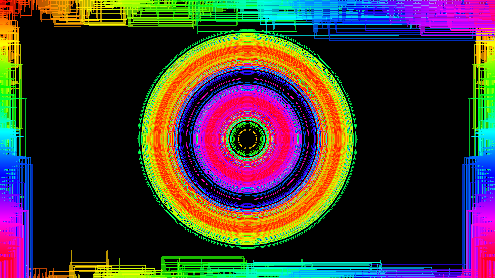
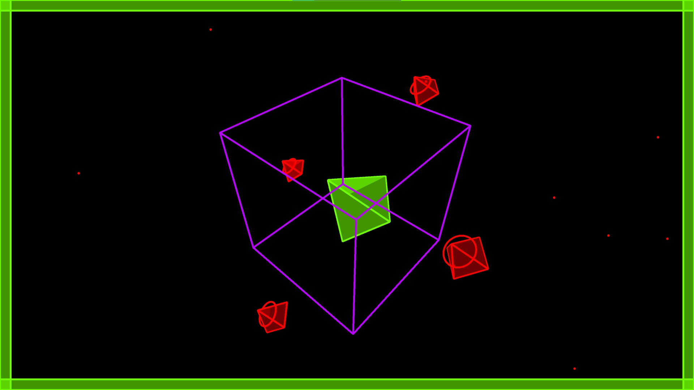

# Music Visualiser Project

| Name | Student Number |
|-----------|-----------|
|Ronan Singpurwala | C20391216 |
|Keiran Retardo Silada | C20483514 |
|Aman Song | C20325896 |
|Eoin O'Toole Carrick | C20310571 |

# Description Of The Assignment
In this assignment we have 4 visualisations using java processing. Each section was made by a different person in the group. Our visualisations respond to the amplitude of the music and frequency by changing colours, sizes of shapes and so on. To extract audio from an mp3 file, we used the audio minum library. 

# Instructions
- run the main.java file in the C20391216 folder.
- space bar is to pause/unpause audio.
- You can switch through the visualisations using the 1, 2, 3 and 4 keys.
- Note that visualisations switch automatically at certain parts of the song which suits that particular visualisation best.

# How It Works
Each visualisation has its own class and they are all in the same packet. We inherit the Visual class so we can use methods in that class in our visulations. We use inheritance and polymorphism to generate objects. 

# What Are We Most Proud Of In The Assignment
We are all proud of the amount of effort and research we put into this assignment. We believe our visuals go well together with our song choice so when the beat drops it suits the visualiser perfectly and that overall makes watching it an overall better experience.

In Ronan class we were able to have particles in the background along with rotating 3d objects which also change colour with the song which we are really prouf of because it goes really well with the music assosiatied with it.

# Images From Visualiser
### Visualtisation 1

### Visualtisation 2

### Visualtisation 3

