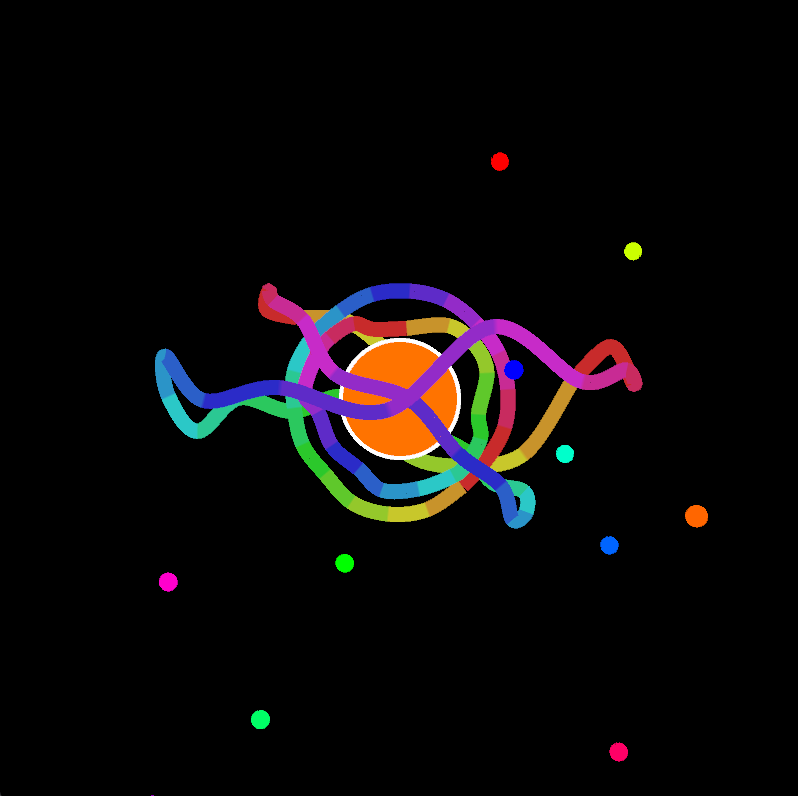
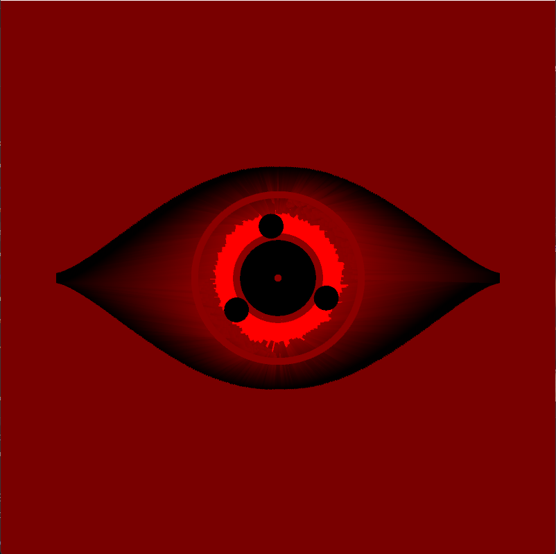
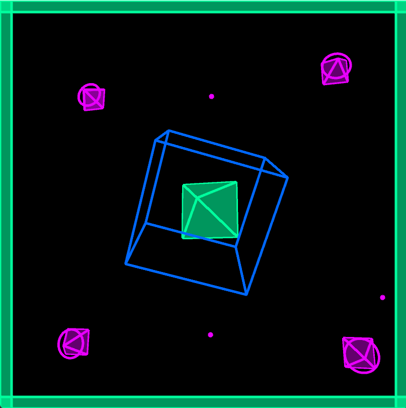
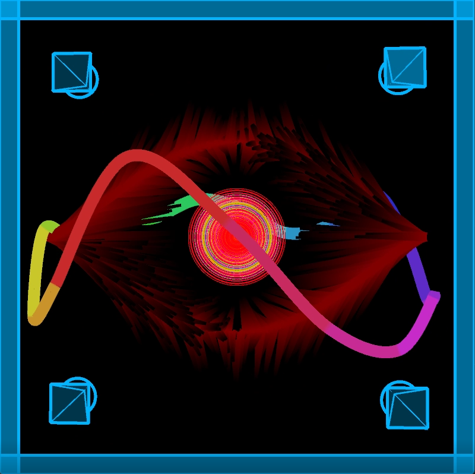

# Music Visualiser Project

# Group Members
| Name | Student Number |
|-----------|-----------|
|Ronan Singpurwala | C20391216 |
|Kieran Silada | C20483514 |
|Aman Song | C20325896 |
|Eoin O'Toole Carrick | C20310571 |

# Video Of Our Visualisations
https://www.youtube.com/watch?v=xAuwouEEJss

# Description Of The Assignment
In this assignment we have 4 visualisations using java processing. Each section was made by a different person in the group. Our visualisations respond to the amplitude of the music and frequency by changing colours, sizes of shapes and so on. To extract audio from an mp3 file, we used the audio minim library. 

# Instructions
- Run the main.java file in the ie\tudublin package.
- **Space bar** is to pause/unpause audio.
- You can switch through the visualisations using the **1, 2, 3 and 4 keys**.
- Pressing **"r"** will restart the song.
- Note that visualisations switch automatically at certain parts of the song which suits that particular visualisation best.

# How It Works
Each visualisation has its own class and they are all in the same package. Enemy.java is the driver file for this project. We created 4 objects for the visualisation. We used inheritance to use methods like "calculateAverageAmplitude" from the Visual class. Using the minim we loaded in the Enemy.mp3 which is done in the setup method.

```java
Eoin Eoin = new Eoin(1920);
Kieran Kieran = new Kieran(1024);
Ronan Ronan = new Ronan();
Aman Aman = new Aman();
```
each visualisation has a method named "render" which displays the visuals. The objects created in the Heathens class would call the render method inside a switch statement statement so the user can switch between which each visualisation.

```java
switch(mode)
{
    case 1: //Eoin SECTION 1
    {
        Eoin.render(this);
        break;
    }

    case 2: //Kieran SECTION 2
    {
        Kieran.render(this);
        break;
    }

    case 3: //Aman SECTION 3
    {
        Aman.render(this);
        break;
    }

    case 4: //Ronan SECTION 4
    {
        Ronan.render(this);
        break;
    }
}
```
### Section 1 Eoin 
My visualisation uses circles and rectangles as a border to almost simulate 3D wave based on amplitude. My class uses a lerped buffer to store amplitude of the audio in order to make the visuals of the rectangles to change colour and size depending on the amplitude of the song at that moment in time. The size and colours of the circles also dynamically change with the song to create an almost hypnotic effect.


### Section 2 Kieran
My visualisation is a group of 3D ring visualisers that spin and rotate around a circle in the middle almost like the planet Saturn. Random spheres also rotate around the middle which blip in and out depending on the amplitude of the song. My class also uses a lerped buffer in order to map the visualiser. The ring is drawn along the z and x-axis using sin and cos functions with its height being dictated depending on the value in the lerped buffer. The rotation of the rings is based on the amplitude of the song and some custom values with the colors being mapped as the ring is drawn in a for loop. The circle becomes bigger with the amplitude along with the color changing with it. 



### Section 3 Aman
My visualisation comprises of an eye shape made using begin shape and math stuff like sin and cos. The center iris dilates with the songs amplitude. The three tomoes also increase in size by amplitude slightly but mainly revolves around the iris, speeding up as the amplitude increases. The background is mainly red and its intensity increases too by amplitude. 



### Section 4 Ronan
My visualisation comprises of a rotating prism in the middle of the screen surrounded by a cube rotating the opposite direction and a border. There are also 4 smaller prisms rotating along with the bigger prism using proccesing's translate method. I used the getSmoothedAmplitude method to get the amplitude and use it as the bases of my sound reponsive visuals. The shapes and borders change different colours depending the amplitude. I used the HSB colour mode and  the map function given by the PApplet library to make my shapes respond to the amplitude. I also changed the size and rotation speed of each shape. I used 3 different colours to make my visuals look more appealing. Finally I added a particles with varying sizes in the backgound, the higher the amplitude the more particles there are.



# What Are We Most Proud Of In The Assignment
We worked hard as a group and in the end we produced a great project which we are very proud of. We wanted to display our knowlegde we learnt in this module and we believe this project demonstrates this. We are content with our use of inheritance, polymorphism, the PApplet library, objects and programming concepts.

In our opinion, we are most proud of our 5th visualisation near the end of our song. It is the amalgamation of all our hard work and research into this project. Combining aspects of each section and having it work harmoniously is proof of how well our visuals go together. Each combined aspect complement with Eoin's colorful circles, Kieran's complex 3D ring visualiser, Aman's fluttering eye shape Sharingan and Ronan's reactive border and prisms


